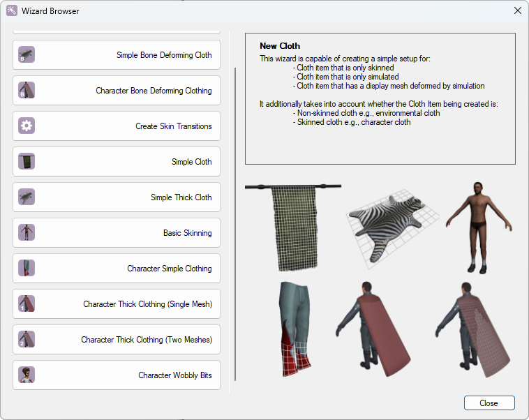

# Exporting your mesh

Once everything is set up, export the scene by pressing:

**`Export FBX And Run Importer`**

This will export the scene and automatically launch the Havok Filter Manager with your data loaded.

For the specific setup required, you can get it from [here](https://github.com/tlarok/blender-fbximporter/blob/main/defaults.hko).

Once the setup is loaded, the configuration will change, and you should see the following options:

* **Create Tangents**
* **Create Skeleton**
* **Create Cloth Collidables**
* **Setup Cloth**
* **Execute Cloth Setup (Ds3)**
* **Prune Types**
* **Write to Platform**

## Step-by-step Setup

1. **Choose `Setup Cloth`**
   In the new window on the right, click **`Launch Cloth Setup Tool`**. Ensure that `Cloth Setup Tool Mode` is set to **`Standalone`**. **`Modal`** technically works but is not recommended.

2. **Cloth Setup Tool**
   When the Cloth Setup Tool opens, you will see an empty cloth entity. You can delete this entity. Next, click on the **`Script`** tab at the top, and select **`Wizard Browser...`**. This will pop up a window with different cloth simulation types. While you can create most of them manually, this guide will cover only the following types:

   * **[Simple](sim_simple.md)**
   * **[Thick Single Mesh](sim_thick_one_mesh.md)**
   * **[Two Mesh Simulation](sim_thick_two_mesh.md)**

