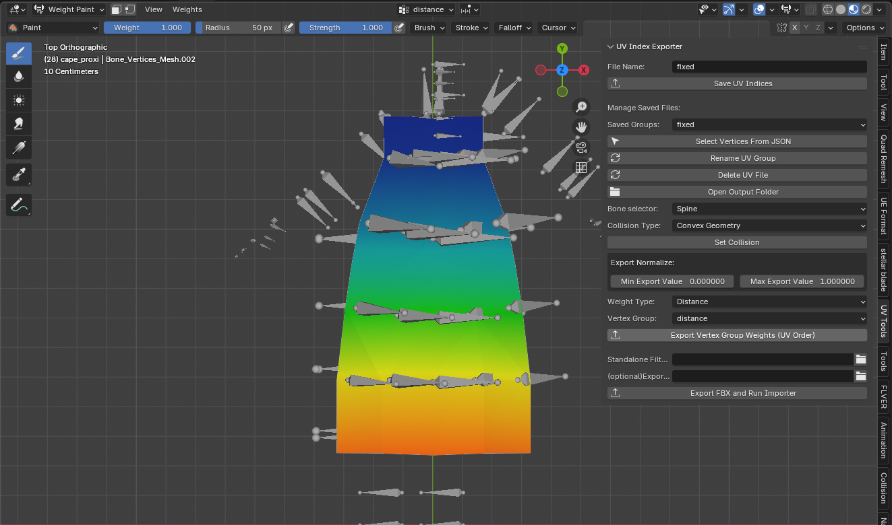

# Setting up your mesh for cloth simulation

Havok uses **vertex-based cloth simulation**, which is what this workflow supports.
The simulation is physically accurate, but for performance reasons **self-collision is not supported**.

---

## Selection Sets / UV Indices

These are vertex selections used to define different behavior zones. Common usage includes:

* Simulated vertices
* Fixed vertices
* Display-only vertices
* Collision or other constraint groups

To create them:

1. Select the mesh
2. Enter **Edit Mode**
3. Select the desired vertices
4. Fill in the **Section Name**
5. Press **Save UV Indices**

This will create an entry in:

* `blend_path/export_data/selectionsets/uv_indices.json`, or
* `optional_export_path/selectionsets/uv_indices.json`

---

## Vertex Selection Groups

Vertex groups are float-based selections used when non-uniform values are required.

To export a vertex group:

* Create a vertex group on the mesh
* Set **Min Export Value** and **Max Export Value**
* Select the **Weight Group** to export
* Choose a **Weight Type**

Available weight types:

* **Distance**
  Used for distance constraints or collision radii.
* **Float**
  Used for modifiers.
* **Angle**
  Used for angle-based modifiers.

* Press a **Export Vertex Group(UV Oder)**

The data will be saved to:

* `blend_path/export_data/floatchannels/weight_groups.json`, or
* `optional_export_path/floatchannels/weight_groups.json`

---

## Collidables

Because cloth meshes move dynamically, precise control over their position is difficult.
Collidable shapes are used to restrict or guide movement. The following collidable shapes are available:

* Capsule
* Sphere
* Plane
* Convex Geometry
* Convex Heightfield

### Notes on Collidables

* Collidable objects use the prefix `collision_<type>` so the addon can identify and skip them during processing.
* They often include a **bone name prefix** to assign the collidable to a specific bone.
* Collidables do **not** need to be parented to the armature and should remain disconnected.

### Creating and Assigning Collidables

* Select a mesh or collidable object shape type you want to change
* Choose a **Collision Type**
* Assign a bone using the **Bone Selector** (if needed)
* Press **Set Collision** to convert the mesh into the selected collision shape

If the object is already a collidable, it will be updated except a Bone Selector if already set.

When selecting an **armature**, a **Place Collidable** button appears:

* Select **one bone** in Edit/Pose mode → create a **sphere**
* Select **two bones** in Edit/Pose mode → create a **capsule**

## Capsule Resizing

When a **capsule collidable mesh** is selected, additional resize options will appear.

Capsules can be resized using the following control points:

* **Bottom**
* **Middle**
* **Top**

To resize the capsule:

1. Toggle the desired controls (`Bottom`, `Middle`, and/or `Top`)
2. Press **Resize Capsule** to apply the changes

If the capsule's size choses is **uneven**, the collidable effectively becomes a **Tapered Capsule**.

???+ note

    Tapered Capsules are not supported by the addon. For proper functionality, it is recommended to convert the collidable to **Convex Geometry**.
