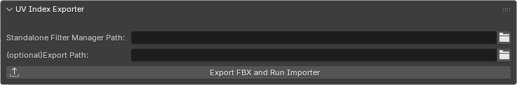

# Setup

## Installation

***TODO***

## Configuration

### Step 1: Install Havok

1. Download and install Havok using the executable provided in the **Resources** section. During installation, make sure to save the installation path for later use.
2. After the installation is complete, open the `New DLL` folder included in the **Resources** ZIP archive and copy the provided `.dll` file.
3. Navigate to the Havok installation directory and open the following folder path (or a similar one depending on your installation location):
   `Havok\HavokContentTools\filters`
4. Paste the `.dll` file from the `New DLL` folder mentioned in *Step 2* into the filters folder.
   If Windows asks for confirmation, choose *Replace the existing file*.

### Step 2: Configure the Tool

Once Havok is installed, you can proceed to configure the tool and its core features.

After installing the addon, you will see a new tab in the right-hand sidebar (press `N` if it doesn’t show up) called **UV Tools**. Once you open it, you will see the following two fields:

### Standalone Filter Manager Path

The path you saved earlier during the Havok installation is required here.
In the **Standalone Filter Manager Path** field, **select** the file `hctStandAloneFilterManager.exe` located inside the folder:
`Havok\HavokContentTools`

### Export Path

This is an optional directory where all your project files will be stored.
If you don’t specify an export path, the addon will automatically create an `export_data` folder next to your current Blender project file. Throughout this guide, this folder will be referred to as `<export>`.

???+ warning

    Your Blender project must be saved somewhere on disk in order for the addon to save setup files and addon functionality.
